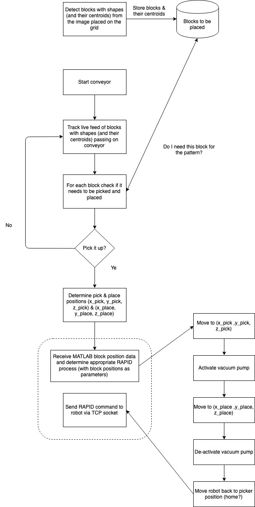
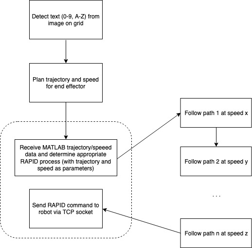

# MTRN4230 Robotics Assignment 2

This repository will hold all the code for assignment 2 including:
| Member | Task | Description  | Language |
| ------ | -----| ------------ | -------- |
| Osborn | Ink Printing | Detect and plan the trajectory for the end effector to simulate printing with edible link | Matlab |
| Cici   | Decoration | Detect Qwirkle blocks that are supplied using the conveyor and detect the customer's desired decorating pattern from the camera view | Matlab   |
| Erik   | GUI & Network | Provide a simple user interface for the user to start/stop and pause/resume the robot operations as well as show the status of the robot and task completion status. Provide Matlab networking capability to relay plans from the result of image processing to the robot via ethernet | Matlab |
| Jack   | Ink Printing | Program the robot to follow the path marking the outline of the customer's desired text | RAPID |
| Antony | Decoration | Pick and place the correct cake decorations as specified. Decorations in the form of Qwirkle blocks will be fed from the conveyor | RAPID |
| Jason | Peripherals & Safety | Control conveyor and vacuum pump, make sure the robot handles any error cases | RAPID |


## Task 1: Decoration



## Task 2: Ink Printing




## Adding to the codebase (command line [Git](https://www.atlassian.com/git/tutorials/install-git))

**If you're pushing code to github send me your Github email address so I can add you as a collaborator**

Ideally, the `master` branch will hold all of our finalised code (tested and working). While you're working on 
your task you can work on your own branch as shown below. Once it's ready you can submit a pull 
request and merge it into the `master` branch.

1. Clone the Repo
```shell
git clone git@github.com:mvanschellebeeck/MTRN4230-Ass2.git
```
2. Create your own branch
```shell
git checkout -b <name>/<task>
# e.g. if I wanted a testing branch
git checkout -b matt/testing
```
3. Get code onto Github
```shell
# add all modified files to staging
git add .
# commit all the files with a message
git commit -m"Added a function that moves the robot from a to b"
# push it to the github codebase 
git push origin <name>/<task>
```
4. Once your confident it is working, [create a pull request](https://help.github.com/en/articles/creating-a-pull-request)
5. Find the person who will be interacting with your functions and [add them as a reviewer](https://help.github.com/en/articles/requesting-a-pull-request-review)
6. Once you're both satisfied that the interface makes sense, merge it into `master`
